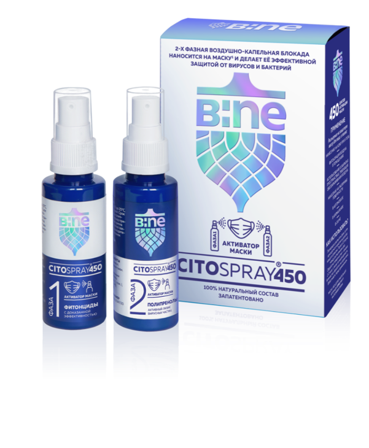
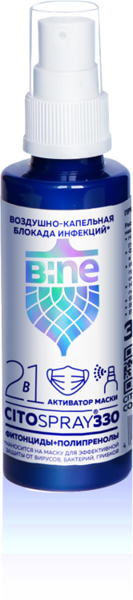

<!DOCTYPE html>
<html lang="en">
<head>
  <meta charset="UTF-8">
  <meta http-equiv="X-UA-Compatible" content="IE=edge">
  <meta name="viewport" content="width=device-width, initial-scale=1.0">
  <link rel="stylesheet" href="style.css">
  <title>Bine-Citospray</title>
</head>
<body>
    <header class="header">
      

        
        
      

    </header>
    <section class="preview">
      
      

        

          
          
        

        

          <ul class="preview__pluses-list">
            <li class="preview__pluses-item">Защита от инфицирования вирусами, 100% защита от COVID</li>
            <li class="preview__pluses-item">Угнетает бактерии ОРВИ, гриппа, кишечных инфекций, пневмонии и золотистого стафилококка и другие</li>
            <li class="preview__pluses-item">Воздушно-капельная блокада большинства инфекций</li>
            <li class="preview__pluses-item">Обеззараживание вдыхаемого воздуха</li>
            <li class="preview__pluses-item">Натуральный дезинфектор для органов слизистых</li>
            <li class="preview__pluses-item">100% натуральный состав (эвкалипт, зверобой, чистотел, полынь, пихта, сосна, полипренолы)</li>
            <li class="preview__pluses-item">Лечение простудных заболеваний и защита от осложнений</li>
            <li class="preview__pluses-item">Укрепление местного иммунитета</li>
            <li class="preview__pluses-item">Анти Акне для кожи, снятие раздражения на коже</li>
            <li class="preview__pluses-item">Снижение симптомов аллергии и облегчение дыхания для астматиков</li>
            <li class="preview__pluses-item">Нет противопоказаний, кроме индивидуальной непереносимости</li>
          </ul>
        

      

    </section>
</body>
</html>
